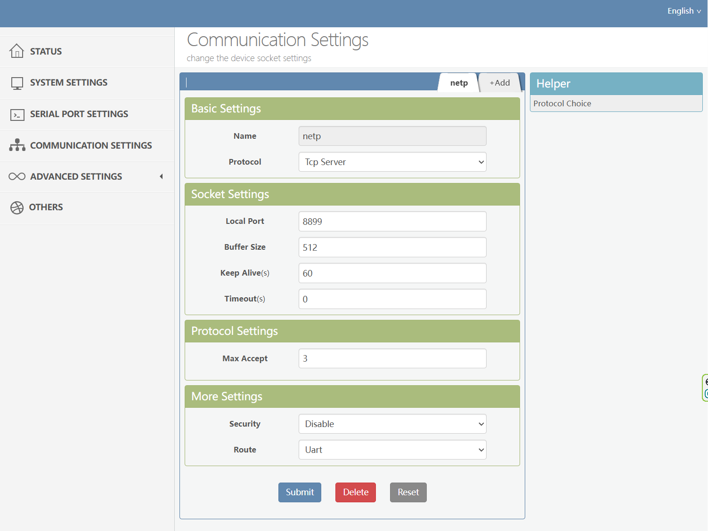
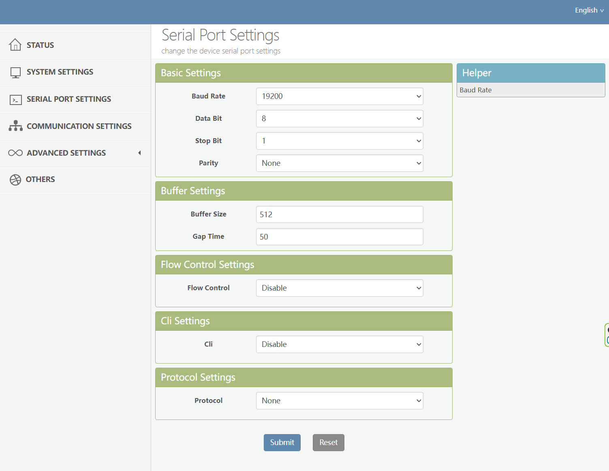

# Aurora Inverter Monitor

<div align="center">


[](https://opensource.org/licenses/MIT)
[](https://www.python.org/downloads/)
[](https://flask.palletsprojects.com/)
</div>

A web application to monitor and visualize production data from Aurora/Power-One/ABB/FIMER photovoltaic inverters in real-time.

Un'applicazione web per monitorare e visualizzare i dati di produzione degli inverter fotovoltaici Aurora/Power-One/ABB/FIMER in tempo reale.

## 📊 Preview


## 🚀 Features
- **Real-time monitoring** of inverter data
- **Interactive charts** for power production visualization
- **Historical data storage** for long-term analysis
- **Responsive web interface** accessible from any device
- **Docker support** for easy deployment

## 📋 Requirements
- Python 3.8 or higher
- Aurora/Power-One/ABB/FIMER inverter accessible via network
- [Hi-Flying Elfin EW10/EW11](http://www.hi-flying.com/elfin-ew10-elfin-ew11) Serial-to-WiFi module for inverter connectivity
- Docker and Docker Compose (optional, for container installation)

## 🔧 Installation

### Method 1: Direct Installation
1. Clone the repository:
   ```bash
   git clone https://github.com/yourusername/aurora-monitor.git
   cd aurora-monitor
   ```

2. Install dependencies:
   ```bash
   pip install -r requirements.txt
   ```

3. Configure your inverter settings in `aurora_config.json`:
   ```json
   {
     "inverter_host": "192.168.1.xxx",
     "inverter_port": 8899
   }
   ```

4. Start the application:
   ```bash
   python aurora_web_app.py
   ```

### Method 2: Docker Installation
1. Clone the repository:
   ```bash
   git clone https://github.com/yourusername/aurora-monitor.git
   cd aurora-monitor
   ```

2. Edit the `docker-compose.yml` with your inverter parameters:
   ```yaml
   environment:
     - INVERTER_HOST=192.168.1.xxx  # Your inverter IP
     - INVERTER_PORT=8899           # Your inverter port
   ```

3. Build and run with Docker Compose:
   ```bash
   docker-compose up -d
   ```

## 📱 Usage
Once running, access the web interface at:
- Direct installation: http://localhost:5000
- Docker installation: http://localhost:5000 (or your Docker server IP)

### Main Dashboard
The dashboard displays:
- Current power output
- Daily energy production
- Inverter efficiency
- Production chart
- Technical details (input voltages and currents, temperature, etc.)
- Energy production (daily, weekly, monthly, yearly, and total)

### Configuration
Access the configuration page by clicking on "Configuration" to modify:
- Inverter IP and port
- Data polling intervals
- Web server settings
- Other application settings

## 🔌 Hardware Setup
This project uses the Hi-Flying Elfin EW10/EW11 Serial-to-WiFi module to connect to the Aurora inverter via RS485. 

### Connection Diagram
```
Aurora Inverter (RS485) <-> Elfin EW10/EW11 <-> WiFi Network <-> Aurora Monitor Application
```

### Module Configuration
The Elfin EW10/EW11 requires specific configuration to communicate with Aurora inverters:

#### Communication Settings


Configure the module with:
- Working Mode: TCP Server
- Local Port: 8899
- Baud Rate: 19200
- Data Size: 8
- Parity: None
- Stop Bits: 1

#### Serial Port Settings


Ensure serial settings match the inverter's RS485 specifications:
- RS485 Mode enabled
- Proper termination if the device is at the end of the RS485 bus

## 🏗️ Architecture
The project consists of the following components:

### `aurora_client.py`
Python client for communicating with Aurora inverters via TCP/IP protocol. Implements commands to query the inverter and retrieve:
- Output power data
- Input voltages and currents
- Temperatures
- Energy production

### `aurora_web_app.py`
Flask web application that:
- Starts background monitoring
- Provides REST APIs for data access
- Manages SQLite database for storage
- Serves the user interface

### Web Interface
- `templates/index.html`: Main dashboard with charts and data visualization
- `templates/setup.html`: Configuration page

### Database
Data is stored in a SQLite database with:
- Timestamp for each reading
- Complete production and inverter status data
- Production history for analysis

#### `readings` Table Structure
```sql
CREATE TABLE readings (
    id INTEGER PRIMARY KEY AUTOINCREMENT,
    timestamp TEXT NOT NULL,
    power_output REAL,
    voltage_1 REAL,
    current_1 REAL,
    voltage_2 REAL,
    current_2 REAL,
    temperature REAL,
    grid_voltage REAL,
    efficiency REAL,
    peak_today REAL,
    energy_today REAL,
    energy_week REAL,
    energy_month REAL,
    energy_year REAL,
    energy_total REAL
)
```

## ⚙️ Configuration Options
| Parameter | Description | Default |
|-----------|-------------|---------|
| `inverter_host` | Inverter IP address | 192.168.1.100 |
| `inverter_port` | Inverter TCP port | 8899 |
| `polling_interval` | Seconds between readings | 300 |
| `ui_refresh_interval` | UI refresh interval | 30 |
| `web_host` | Web server IP address | 0.0.0.0 |
| `web_port` | Web server port | 5000 |
| `db_path` | Database file path | aurora_data.db |

## ❓ Troubleshooting
### Cannot connect to inverter
- Verify that the inverter is powered on and connected to the network
- Check that the IP address and port are correct
- Verify that there are no firewalls blocking communication
- Ensure your Elfin EW10/EW11 module is properly configured
- Check RS485 connections and termination

### Data not displaying correctly
- Check application logs for errors
- Verify that the database is accessible and writable
- Restart the application

## 🤝 Contributing
Contributions are welcome! To contribute:
1. Fork the repository
2. Create a branch for your feature: `git checkout -b feature/new-feature`
3. Commit your changes: `git commit -am 'Add new feature'`
4. Push to the branch: `git push origin feature/new-feature`
5. Submit a Pull Request

## 📄 License
This project is distributed under the MIT License. See the `LICENSE` file for details.

## 🙏 Acknowledgements
- Thanks to the developer community that worked on the Aurora protocol
- Thanks to all users who tested and provided feedback on the project
- Thanks to Hi-Flying for their Elfin EW10/EW11 Serial-to-WiFi modules

## 🐳 Docker Deployment
```bash
# Build Docker image
docker build -t aurora-monitor:latest .

# Save Docker image
docker save aurora-monitor:latest -o aurora-monitor.tar

# Load Docker image on target server
mkdir -p ~/docker-temp
cp /path/to/aurora-monitor.tar ~/docker-temp/
cd ~/docker-temp
docker load -i aurora-monitor.tar

# Run Docker container
docker run -d \
  --name aurora-monitor \
  --restart unless-stopped \
  -p 5000:5000 \
  -v aurora-data:/data \
  -e INVERTER_HOST=192.168.1.100 \
  -e INVERTER_PORT=8899 \
  -e POLLING_INTERVAL=300 \
  -e TZ=Europe/Rome \
  aurora-monitor:latest
```